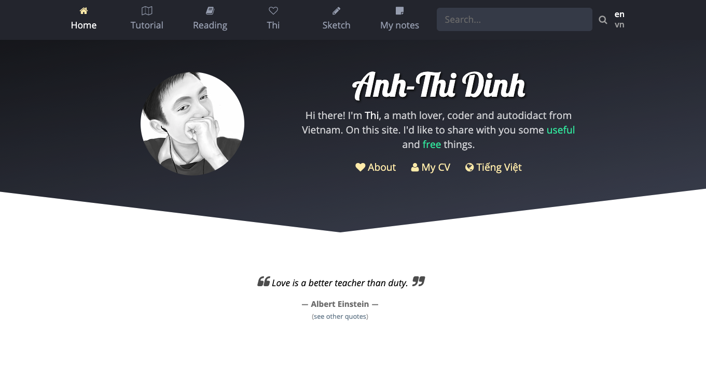
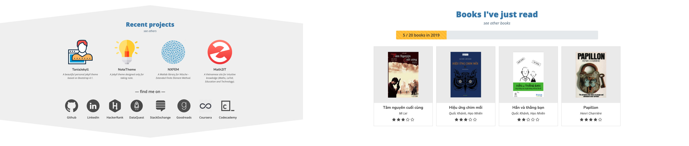
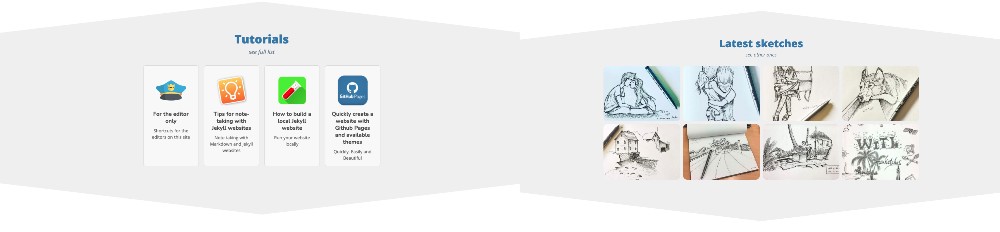
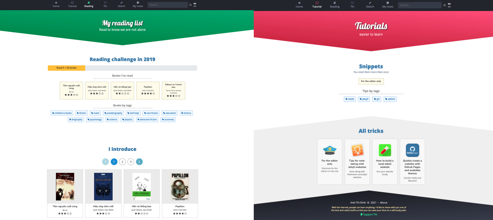
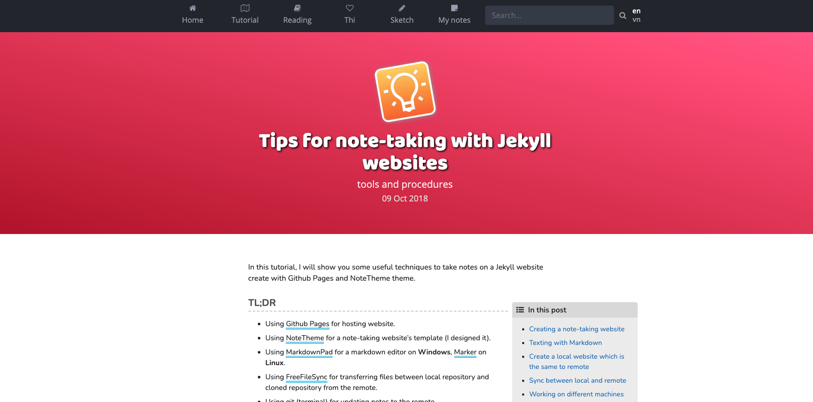

# v2.dinhanhthi.com [](https://app.netlify.com/sites/cocky-goldstine-a62eec/deploys)

Source code of my personal website (using Jekyll). If you would like to use this source code, please indicate me in the credit and let me know first, thanks! My email: dinhanhthi@gmail.com.

🚀 **Demo**: https://v2.dinhanhthi.com

🔥 **Current version**: https://dinhanhthi.com

<details>
<summary>Some screenshots.</summary>











</details>

## How to use quickly?

1. Clone to your github.
2. Create a [Netlify](https://www.netlify.com/) account.
3. Link Netlify to your account.
4. Create a new site and link to the cloned repo.
5. Wait for Netlify to build your site.
6. Voila.

## Build and deploy locally

### Using docker?

``` bash
# build container
cd docker
docker-compose -p "dat_v1" up -d
# wait a little bit for it to build at the 1st time

# whenever working
docker start dat_local_v1
# NOTE: for the 1st run, it takes a little long time to build and serve
# You can check what are running on background with
docker attach dat_local_v1
```

### From scratch

__Note__: On Windows, you should [use WSL2](https://dinhanhthi.com/docker-wsl2-windows) to run Jekyll site.

After cloning to a local server, run these:

~~~
# install git

# install ruby
ruby --version

# install bundler
gem install bundler

# cd to the repo directory and install gems
bundle install

# run the server (http://localhost:4000)
bundle exec jekyll serve

# incremental build (only build the changes, faster)
bundle exec jekyll serve -I
~~~